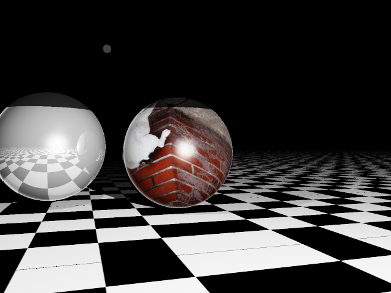

Volk 3D Renderer
==============

Introduction
-----------

Volk is a simple 3d renderer, started off as a naive raytracer with plans to support more advanced features such as photon mapping, radiosity and MLT.

Raytracing
----------

Features so far:

* ray casting
* Phong shading
* reflections (multiple depth)
* textures (partial)
* naive anti-aliasing
* threading (slow and might be broken)

Shapes:

* sphere
* plane

Lights:

* point light

Pictures
-----------

TODO
----------

Add:

* reduce the number of new() calls
* figure out what the hell is wrong with threading